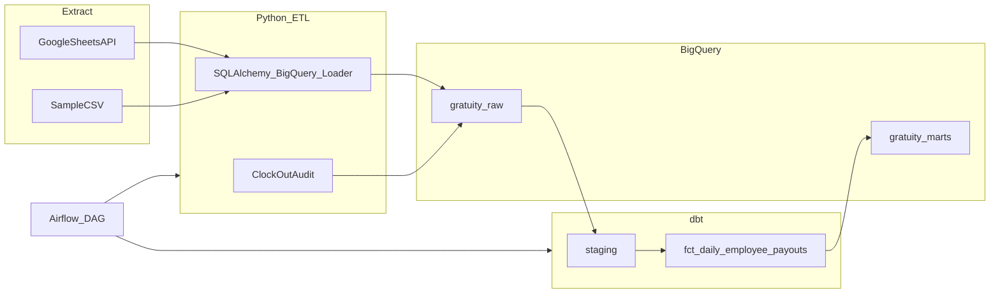

# GratuityETL — Full-Stack Tip Proration Pipeline

Restaurant tip distribution is often manual and error-prone. **GratuityETL** automates fair tip proration based on hours worked per shift, with an audit trail for mid-shift clock-outs.

**Stack:** Python · SQLAlchemy · dbt · BigQuery · Apache Airflow · Google Sheets API

---

## Problem and solution

| Challenge | GratuityETL approach |
|-----------|---------------------|
| Shift data lives in spreadsheets | Google Sheets API extract (sample CSV for demo) |
| Mid-shift departures need a record | Append-only `audit_log` snapshots |
| Tips combine auto-gratuity + cash/credit | dbt models compute pool and prorate by hours |
| Manual recalculation is risky | Daily Airflow DAG + dbt tests validate payout totals |

### Architecture



---

## Business logic

### Tip pool

```
total_tip_pool = (gross_sales × 0.19) + cash_tips + credit_tips
```

- **19%** = pooled auto-gratuity from daily gross sales
- **Cash/credit tips** = additional amounts entered on the `DailyTips` tab

### Proration

```
employee_payout = (employee_hours_on_day / total_hours_all_staff_on_day) × total_tip_pool
```

The mart table `fct_daily_employee_payouts` also exposes `hours_share_pct`, `auto_gratuity_share`, `cash_share`, `credit_share`, and `total_payout`.

### Mid-shift clock-out audit

A snapshot is written when:

- `is_mid_shift_clockout = true` in source data, **or**
- `hours_worked` is greater than 0 but less than `EXPECTED_SHIFT_HOURS` (default 8)

---

## Cost and free-tier guardrails

| Component | Cost |
|-----------|------|
| Apache Airflow (local Docker) | Free |
| dbt Core | Free |
| BigQuery (sample data volume) | Free tier — pennies at most |
| Google Sheets API | Free for prototype read volume |
| Cloud Composer | **Not used** (would cost ~$300+/month) |

**Tips to stay at $0:**

1. Use local Airflow via `docker-compose.yml`, not Cloud Composer
2. Set a GCP budget alert at $1–$5
3. Keep sample data small (included CSVs cover 5 days)
4. Delete unused BigQuery tables if you experiment heavily

GCP signup typically requires a credit card for verification even on the free tier.

---

## GCP setup checklist

1. Create a GCP project and enable **BigQuery API**
2. Create a service account with roles:
   - `BigQuery Data Editor`
   - `BigQuery Job User`
3. Download JSON key → save as `credentials/service-account.json`
4. (Optional) Enable **Google Sheets API** and share your sheet with the service account email
5. Run bootstrap DDL: [`sql/ddl/bootstrap_datasets.sql`](sql/ddl/bootstrap_datasets.sql) (replace project id)
6. Copy [`.env.example`](.env.example) → `.env` and fill in values

---

## Quick start

### 1. Install dependencies

```bash
cd "Gratuity ETL"
python3 -m venv .venv
source .venv/bin/activate
pip install -r requirements.txt
pip install dbt-bigquery
```

### 2. Configure environment

```bash
cp .env.example .env
# Edit .env with GCP_PROJECT_ID and GOOGLE_APPLICATION_CREDENTIALS
```

### 3. Configure dbt

```bash
cp dbt/profiles.yml.example ~/.dbt/profiles.yml
# Edit project id and keyfile path
cd dbt && dbt deps
```

### 4. Load sample data to BigQuery

```bash
export PYTHONPATH=".:src"
python scripts/load_all_sample_days.py
```

### 5. Run dbt transforms

```bash
cd dbt
export GCP_PROJECT_ID=your-project-id
dbt run
dbt test
```

### 6. Query results in BigQuery

```sql
SELECT *
FROM `your-project-id.gratuity_marts.fct_daily_employee_payouts`
ORDER BY shift_date, employee_name;
```

### 7. Start Airflow (optional orchestration)

```bash
export AIRFLOW_UID=$(id -u)
docker compose up airflow-init
docker compose up -d
```

Open http://localhost:8080 (default login: `admin` / `admin`), unpause `gratuity_etl_daily`, and trigger a run.

Set `PIPELINE_RUN_DATE=2025-06-01` in `.env` to process a specific sample day.

---

## Project structure

```
GratuityETL/
├── config/settings.py          # Environment configuration
├── src/gratuity_etl/
│   ├── extract/                # Google Sheets + sample CSV
│   ├── load/                   # SQLAlchemy → BigQuery
│   ├── audit/                  # Mid-shift clock-out snapshots
│   └── pipeline.py             # CLI entry points
├── dbt/                        # Staging → marts transformations
├── dags/gratuity_etl_daily.py  # Airflow DAG
├── data/sample/                # Prototype CSV data
├── scripts/                    # Helper scripts
└── docker-compose.yml          # Local Airflow
```

---

## Sample data edge cases

| Scenario | Date | What happens |
|----------|------|--------------|
| Standard 3-person day | 2025-06-01 | Hours prorated 8 / 6 / 6 |
| Mid-shift clock-out + second shift | 2025-06-02 | Alex 4h audit + 6h shift → 10h total |
| Zero-hour shift | 2025-06-02 | Sam excluded from payouts (`hours_worked = 0`) |
| Uneven cash vs credit tips | 2025-06-02 | High cash day; shares split by hours |
| Mid-shift only (no return) | 2025-06-05 | Alex 3h audit snapshot |

### Example output (2025-06-01)

| employee | hours | share | total_payout |
|----------|-------|-------|--------------|
| Alex | 8.0 | 40% | ~$356.25 |
| Jordan | 6.0 | 30% | ~$267.19 |
| Sam | 6.0 | 30% | ~$267.19 |

*Pool: $2,500 × 19% + $120 + $180 = $890.75*

---

## Assumptions

- All tipped staff share one pool (no role-based weighting yet)
- Proration uses **hours worked only**
- 19% auto-gratuity applies to **gross sales**
- One business date per pipeline run (default: yesterday)
- Shift reload for a date is idempotent (delete + insert for that date)
- `audit_log` is append-only

---

## Edge cases handled

- Multiple shifts per employee per day (hours summed)
- Mid-shift clock-out audit snapshots
- Zero-hour employees excluded from mart
- Missing `hours_worked` computed from clock in/out in dbt
- Rounding: dbt test allows ≤ $0.02 daily variance across employees

---

## Google Sheets format

**Shifts tab** columns: `shift_date`, `employee_name`, `clock_in`, `clock_out`, `hours_worked`, `is_mid_shift_clockout`

**DailyTips tab** columns: `shift_date`, `gross_sales`, `cash_tips`, `credit_tips`

Set `DATA_SOURCE=sheets` and `GOOGLE_SHEETS_ID` in `.env` to use live Sheets instead of CSV.

---

## Pipeline CLI

```bash
export PYTHONPATH=".:src"
python -m gratuity_etl.pipeline extract_shifts
python -m gratuity_etl.pipeline load_raw_tables
python -m gratuity_etl.pipeline capture_audit_snapshots
python -m gratuity_etl.pipeline run_full_pipeline
```

---

## Future enhancements

- Role-based tip weights (bartender vs server)
- Looker / Metabase dashboard on `fct_daily_employee_payouts`
- Cloud Composer deployment for managed Airflow
- CI/CD (GitHub Actions: dbt test on PR)
- Terraform for GCP resources
- Real-time clock-out webhooks instead of batch snapshots

---

## Resume bullets

Copy-paste (adjust project name/company as needed):

- Built **GratuityETL**, an end-to-end tip proration pipeline for restaurant shift data using **Python**, **SQLAlchemy**, **dbt**, **BigQuery**, and **Apache Airflow**
- Designed **Google Sheets API** extraction and idempotent raw loads into BigQuery with an **append-only audit log** for mid-shift clock-out events
- Implemented **dbt** staging/intermediate/mart models applying hours-based tip pool proration (19% auto-gratuity + cash/credit tips)
- Orchestrated daily pipeline runs with **Airflow**, including dbt tests validating payout totals match tip pool amounts

---

## Interview talking points

1. **Why delete+insert per day?** Idempotent replays if a DAG retries; avoids duplicate shift rows.
2. **Why audit log is append-only?** Preserves point-in-time evidence if tips are recalculated after early departures.
3. **Why dbt for proration?** Business logic is versioned SQL with tests — easier for analysts to review than buried Python.
4. **Why Airflow?** Explicit dependencies, retries, and scheduling for a daily finance workflow.
5. **Data quality:** `not_null`, `unique`, and custom test that daily payouts sum to the tip pool.

---

## License

MIT — portfolio / educational use.
