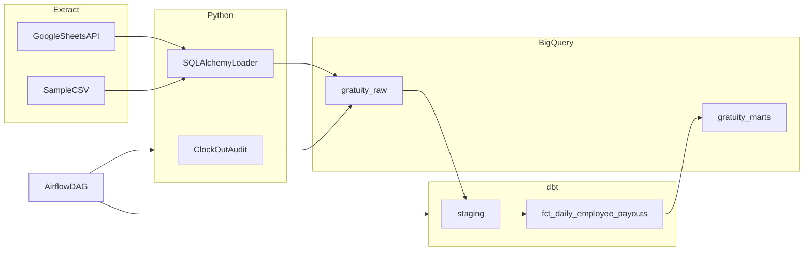

# GratuityETL — Restaurant Tip Proration Pipeline

**Stack:** Python · SQLAlchemy · dbt · BigQuery · Apache Airflow · Google Sheets API · Docker

---

## Purpose of Pipeline
Restaurant staff often share tips based on hours worked, but doing that by hand in a spreadsheet is slow and error-prone. **GratuityETL** automates the math: it pulls shift and daily tip data, loads it into BigQuery, and uses **dbt** to calculate each employee's fair payout for the day — split by auto-gratuity, cash, and credit. **Airflow** runs the pipeline on a schedule, and automated tests check that payouts add up to the tip pool.

This is a **portfolio prototype** with included sample CSV data. You can run it locally without connecting to a real restaurant.

---

## Key features

- **ELT pipeline** — Python extract/load → raw BigQuery → dbt transforms
- **Idempotent raw loads** — delete + insert per business date so daily reruns don't duplicate rows
- **Layered dbt models** — staging → intermediate → mart (`fct_daily_employee_payouts`)
- **15 dbt tests** — null checks, grain validation, and $0.02 reconciliation against the tip pool
- **Append-only audit log** — snapshots when someone clocks out mid-shift
- **Dual extract sources** — sample CSV (default) or Google Sheets API
- **Airflow orchestration** — six-task DAG in Docker with retries

---

## Architecture

| Step | What happens |
|------|----------------|
| **Extract** | Shift + tip rows from CSV or Google Sheets |
| **Load** | Python + SQLAlchemy writes raw tables in `gratuity_raw` |
| **Transform** | dbt builds staging, intermediate, and mart models |
| **Orchestrate** | Airflow DAG ties extract, load, audit, dbt run, and dbt test together |



---

## Business logic

**Tip pool**

```
total_tip_pool = (gross_sales × 0.19) + cash_tips + credit_tips
```

**Proration**

```
employee_payout = (employee_hours / total_staff_hours) × total_tip_pool
```

The mart exposes `hours_share_pct`, `auto_gratuity_share`, `cash_share`, `credit_share`, and `total_payout` per employee per day.

**Mid-shift clock-out audit** — a snapshot is written when `is_mid_shift_clockout = true`, or when hours worked is between 0 and `EXPECTED_SHIFT_HOURS` (default 8).

---

## What's in this repo (data & privacy)

| Included | Not included (gitignored) |
|----------|---------------------------|
| Sample CSV data in `data/sample/` (5 demo days) | Your `.env` file |
| Code, dbt models, Airflow DAG | GCP service account JSON (`credentials/`) |
| `.env.example` with placeholders | Your BigQuery data |

No real restaurant or employee data is committed. Clone the repo, add your own GCP credentials locally, and run against sample data.

---

## Quick start

### 1. Install dependencies

**Do not install Apache Airflow with pip on your Mac** — Airflow runs in Docker (step 7).

```bash
cd "Gratuity ETL"
python3 -m venv .venv
source .venv/bin/activate
python -m pip install --upgrade pip
pip install -r requirements.txt
pip install "dbt-core>=1.9,<2" "dbt-bigquery>=1.9,<1.10"
dbt --version
```

### 2. Configure environment

```bash
cp .env.example .env
cp dbt/profiles.yml.example ~/.dbt/profiles.yml
# Edit .env and profiles.yml with your GCP project id and key path
cd dbt && dbt deps
```

### 3. Bootstrap BigQuery (one-time)

GCP billing must be linked for writes (free tier still applies). Set a $1 budget alert in GCP Console.

```bash
export GCP_PROJECT_ID=your-project-id
export GOOGLE_APPLICATION_CREDENTIALS="/path/to/service-account.json"
python scripts/bootstrap_bigquery.py
```

### 4. Load sample data

```bash
export PYTHONPATH=".:src"
python scripts/load_all_sample_days.py
```

### 5. Run dbt

```bash
cd dbt
dbt run
dbt test
```

### 6. Query the mart

```sql
SELECT *
FROM `your-project-id.gratuity_marts.fct_daily_employee_payouts`
ORDER BY shift_date, employee_name;
```

### 7. Airflow (optional)

Requires [Docker Desktop](https://www.docker.com/products/docker-desktop/).

```bash
docker compose build
docker compose up airflow-init
docker compose up -d
```

Open http://localhost:8080 (login: `admin` / `admin`), unpause **gratuity_etl_daily**, and trigger the DAG.

Set `PIPELINE_RUN_DATE=2025-06-01` in `.env` so the run date matches sample CSV dates.

Stop later with: `docker compose down`

---

## Project structure

```
GratuityETL/
├── config/settings.py           # Environment configuration
├── src/gratuity_etl/
│   ├── extract/                 # Google Sheets + sample CSV
│   ├── load/                    # SQLAlchemy → BigQuery (idempotent loads)
│   ├── audit/                   # Mid-shift clock-out snapshots
│   └── pipeline.py              # CLI entry points
├── dbt/models/                  # staging → intermediate → marts
├── dags/gratuity_etl_daily.py   # Airflow DAG
├── data/sample/                 # Demo CSV data
├── scripts/                     # Bootstrap + bulk load helpers
└── docker-compose.yml           # Local Airflow
```

---

## Sample data edge cases

| Scenario | Date | What happens |
|----------|------|--------------|
| Standard 3-person day | 2025-06-01 | Hours prorated 8 / 6 / 6 |
| Mid-shift clock-out + return | 2025-06-02 | Alex 4h audit + 6h shift → 10h total |
| Zero-hour shift | 2025-06-02 | Sam excluded from payouts |
| Uneven cash vs credit | 2025-06-02 | Shares split by hours |
| Mid-shift only (no return) | 2025-06-05 | Alex 3h audit snapshot |

**Example (2025-06-01):** Pool = $2,500 × 19% + $120 + $180 = **$890.75** → Alex 40%, Jordan 30%, Sam 30%.

---

## Google Sheets format (optional)

Set `DATA_SOURCE=sheets` and `GOOGLE_SHEETS_ID` in `.env`.

**Shifts tab:** `shift_date`, `employee_name`, `clock_in`, `clock_out`, `hours_worked`, `is_mid_shift_clockout`

**DailyTips tab:** `shift_date`, `gross_sales`, `cash_tips`, `credit_tips`

---

## Pipeline CLI

```bash
export PYTHONPATH=".:src"
python -m gratuity_etl.pipeline extract_shifts
python -m gratuity_etl.pipeline load_raw_tables
python -m gratuity_etl.pipeline capture_audit_snapshots
python -m gratuity_etl.pipeline run_full_pipeline
```

---

## Troubleshooting

| Issue | Fix |
|-------|-----|
| pip stuck on `google-auth` versions | Cancel; don't pip-install Airflow locally — use Docker |
| `Dataset gratuity_raw was not found` | Run `python scripts/bootstrap_bigquery.py` |
| `Billing has not been enabled` | Link billing in GCP Console |
| Airflow `dbt_run` can't find profiles | `dbt/profiles.yml` in repo; DAG sets `DBT_PROFILES_DIR` |
| Failed task in Airflow UI | Grid → red task → **Log**; also check `logs/dag_id=gratuity_etl_daily/` |

**macOS:** Do not set `AIRFLOW_UID=$(id -u)` — it breaks Airflow in Docker on Mac.

---

## Future enhancements

- Role-based tip weights (bartender vs server)
- Looker / Metabase dashboard on the payout mart
- Cloud Composer for managed Airflow
- CI/CD (GitHub Actions: `dbt test` on PR)
- Terraform for GCP resources
- Real-time clock-out webhooks instead of batch audit snapshots

---

## Interview talking points

1. **Why ELT?** Load raw first, transform in dbt SQL inside BigQuery — versioned business logic with tests.
2. **Why delete+insert per day?** Idempotent replays on DAG retry; no duplicate shift rows.
3. **Why append-only audit log?** Point-in-time evidence for mid-shift clock-outs without overwriting history.
4. **dbt layers:** Staging cleans data; intermediate aggregates hours; mart applies proration dollars.
5. **Data quality:** 15 tests including custom reconciliation within $0.02 of the tip pool.

---

## Cost notes

Local Airflow (Docker), dbt Core, and sample BigQuery usage stay in the **free tier**. Cloud Composer is **not used** (~$300+/month). GCP signup typically requires a card for verification.

---

## License

MIT — portfolio / educational use.
